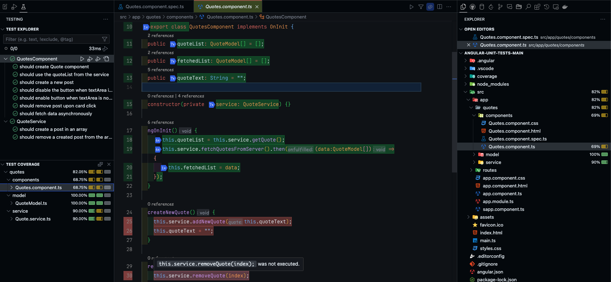
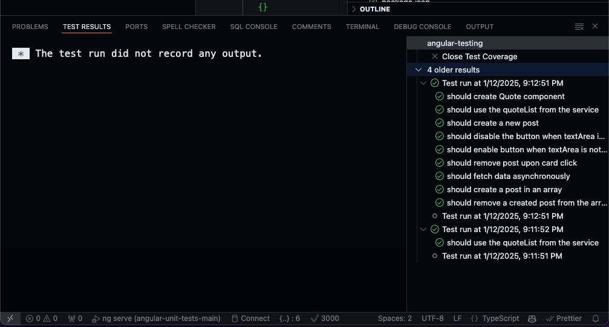

# **[Detailed Blog Post on the Functionality of This Extension](https://dev.to/ravitejavattem/custom-angular-and-karma-test-extension-for-vs-code-3b3b)**

# Angular Karma test extension for vscode
This is an extension for vscode to view, run, debug and check coverage for the angular tests

Based on new [vscode testing api](https://code.visualstudio.com/api/extension-guides/testing) and inspired by [karma test explorer](https://github.com/lucono/karma-test-explorer).

## How to install this extension using VSIX:

- Clone this repository.
- Make sure you have the minimum required node v18.
- Install the dependencies `npm install`.
- Run `npm run pkg` to package the extension which will generate `angular-testing-{version}.vsix` in the root of project.
- Open vscode and go to the extensions tab.
- Click on three dots on the top right corner and click 'Install from vsix' from the menu as shown in the below image.

- Vscode will pop a notification once the installation is successful and it will also be listed in the installed extensions.

How to use the extension:
- Make sure you have installed the extension in first place 😉.
- Find and click the Testing tab which will list all the tests in the project.

- When the vscode is opened after installing the extension the following happens.
    - The extension will find all the tests in the project and list them in the testing tab
    - The extension will boot-up the karma server on the available port
    - We can see the status of the karma server in the status bar (✔️3000 in the image below).

    
    - The karma server will now remain active(until the vscode window is closed) and wait for the user action.
- Only after the Karma server is up(port number on statusbar signifies server is active) we can run, debug or check the coverage.

- We can add debug points in code and debug a test.

- We can check the coverage by clicking on the coverage test, for now we need to click on coverage button after each run or debug testRuns

- Make sure the inline coverage is enabled to show the coverage of the file

- The tests results and the detailed history can be seen in TEST RESULTS tab

- A test failure will be displayed as follows

## Work in progress/ yet to be done
- Reduce the CPU utilization.
- Reduce the load time.
- Run tests from run coverage.
- Add more logging and show notifications to the user as required.
- Reliable cancellation of the process and using cancellation tokens appropriately.
- etc .......

## Troubleshooting
- You might notice some delay in the tasks performed by the extension
(Optimization is in progress).
- This extension writes most of the logs to the output channel shown below

- In most cases, reloading the vscode window will solve most of the issues as the servers will be closed and the extension will be reinitialized.
- If you notice 100% cpu utilization, it could be due to having multiple vscode instances open and each will run its own instance of karma server.

