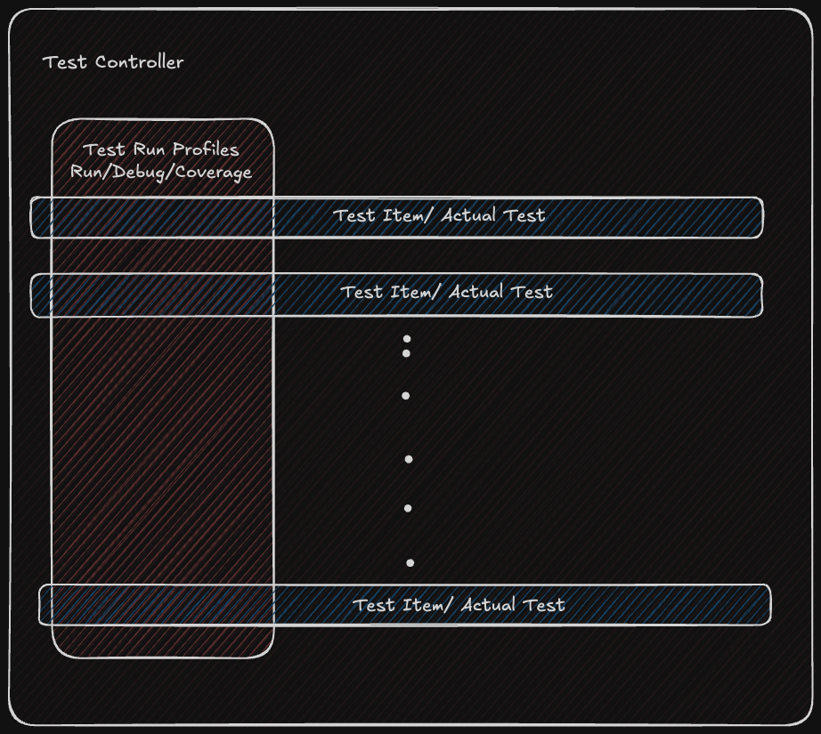
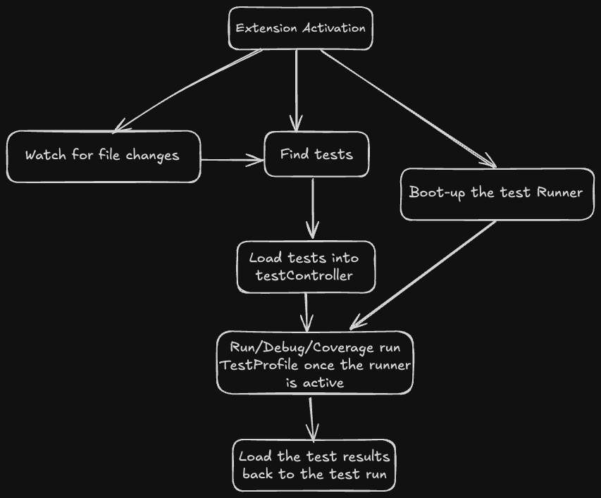
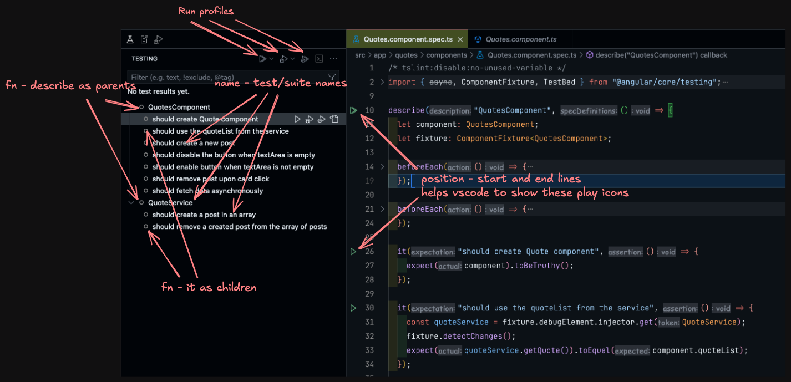

# Angular and Karma Test Extension for VS Code

This Visual Studio Code extension allows you to view, run, debug, and check coverage for your Angular tests. It leverages the new VS Code testing API and is inspired by the Karma Test Explorer.

### List of items

- History
- Expectations from any testing extension we want to build
- About the vscode testing API
- How this extension is built

## History

- Initially, test extensions were expected to run, debug, and check coverage. The Test Explorer UI extension provided these features until the VS Code team natively supported them with the testing API and corresponding UI in version 1.59.
- Now, the VS Code team has added APIs and the UI for most of these features from the Test Explorer UI extension and added several new features, making it easier for developers to create custom test extensions.

## Expectations from any testing extension we want to build

From any testing extension we build, we have a few basic test requirements/functions:

- A proper UI to see the tests in a project
- Option to run a test and check its pass or fail status
- Ability to debug tests
- To check the coverage of the tests executed

## About the VS Code testing API

The VS Code testing API has a few basic concepts:



- TestController: It is the main entry point for the testing API. It is responsible for creating test items and updating the test tree.

```typescript
const controller = tests.createTestController(
	'angularTests', // Unique Id
	'Angular Tests' // Human readable name
);
```

- TestRunProfile: It represents a test run. It can be started, stopped, and debugged. We interact with tests with these profiles.

```typescript
controller.createRunProfile(
	'Run', // Run label
	TestRunProfileKind.Run, // Kind or test run - can be Run, Debug and Coverage
	(request, token) => runTests(controller, request, token), // Run handler which will be executed when we run the tests
	true // isDefault boolean
);
```
The `RunHandler` is the key function which will be executed when user runs a profile. the `request` is of `TestRunRequest` type and it contains information about which tests should be run, which should not be run, and how they are run. `token` is the `CancellationToken` which can be used to cancel the test execution.

- TestItem: It represents a test in the test tree. It can have children and can be run or debugged.
  As described in the [documentation](https://code.visualstudio.com/api/extension-guides/testing#discovering-tests), these are the foundation of test API

```Typescript
    interface TestItem {
        readonly id: string; // unique id
        readonly uri: Uri | undefined; // path(a file or a directory)
        readonly children: TestItemCollection; // children of the test item(can be nested)
        readonly parent: TestItem | undefined; // parent of the test item(will be undefined for top level items)
        range: Range | undefined; //Location of the test item in its Uri,
        ...
    }
```

### Let's now gather our requirements

- [We need to search and list our tests](#we-need-to-search-and-list-our-tests)
- Find/identify a text runner/executor to run our tests
- Start the test runner
- Load our tests into test controller
- Make sure the runner is up and user should be able to Run/Debug/Coverage run the tests
- Collect the text results and update it back to the test run to visually show the status to the user



## We need to search and list our tests

- Tests are written differently in different languages, so vscode doesn't provide any API to find the tests in the files.

As we are building an extension for Angular tests, I used the TypeScript parser to find the tests in the spec files (you can use the parser of your choice for a given language).

- Loop through all the files in the workspace and find the spec files

```typescript
const specFiles = await workspace.findFiles(
	'**/*.spec.ts',
	'**/node_modules/**'
);
```

- Read the content of the file and look for the test keywords (`describe` and `it` in my case as I am using Jasmine)

```typescript
export async function findKarmaTestsAndSuites(file: vscode.Uri) {
	// Read file content
	const rawContent = await vscode.workspace.fs.readFile(file);

	const getNode = (node: ts.Node): IParsedNode | undefined => {
		// Recursively find the describes and its in the file
				return {
					fn: expression.text, // describe or it
					name: testName, // name of the test suite or the test
					location: {
						source: file.fsPath, // file URI
						start, // start line x column of a test suite or the test
						end // end line x column of a test suite or the test
					},
					children: [] // nested node of tests and suites
				};
			}
		}
	};
```



- Things to note
  - Make sure that `it` is children of `describe` such that the children are nested inside parent in the tree shown above.
  - Check for the edge cases where a `describe` can have `describe`s and `it`s we should nest them accordingly.
  - Look out for commented tests and suites (I am identifying them as invalid in my case).

## Find/identify a text runner/executor to run our tests

We just need to run the test server, collect the test results and notify them to vscode (I wish it was that simple)

- I am using karma as test runner here; you can choose one which fits your requirement

We usually run Angular tests through cli `ng test` which picks default config from `<project>/node_modules/@angular-devkit/build-angular/src/webpack/plugins/karma/karma.js`, runs the tests in the project/workspace context, shows the execution log in the terminal and generates coverage using [istanbul.js](https://istanbul.js.org/) based on custom config we defined.

To achieve the same with an extension

- We need to override the default karma config

```typescript
export class KarmaConfigLoader {
	karmaPlugin = { [`reporter:custom`]: ['type', KarmaCustomReporter] };
	loadConfig(config: any) {
		...,
		config.plugins = [
			...,
			'@angular-devkit/build-angular/plugins/karma',
			this.karmaPlugin // Custom karma reporter
		];
		config.coverageReporter = {
			type: 'json',
			dir: `coverage/${process.env[ApplicationConstants.KarmaCoverageDir]}`, // Coverage directory in the extension folder where I want to write my coverage report
			subdir: '.',
			file: 'coverage-final.json' // Name of the coverage json file
		};
		config.reporters = ['progress', 'kjhtml', 'custom']; // Include custom reporter
		config.port = process.env[ApplicationConstants.KarmaPort]; // Karma port passed from the environment
		config.browsers = ['MyChromeHeadless']; // I am running chrome in headless mode
		config.singleRun = false; // We want the server to be running in the background until the vscode instance is closed
		config.customLaunchers = {
			MyChromeHeadless: {
				base: 'ChromeHeadless',
				flags: [
					'--disable-gpu',
					'--disable-dev-shm-usage',
					`--remote-debugging-port=${
						process.env[ApplicationConstants.KarmaDebugPort] // Debug configuration and port we use to debug a test
					}`
				]
			}
		},
		...
	}
}
```

- Run ng test using a node process

```typescript
let processArgs = [
	`${workspacePath}/node_modules/@angular/cli/bin/ng`,
	'test',
	`--karma-config=${CUSTOM_KARMA_CONFIG_FILE_PATH}`, // This will be part of extension code, but will be build separately to be able to pick during run time
	'--code-coverage',
	'--progress=false'
];

const processEnv = {
	...process.env,
	[ApplicationConstants.KarmaPort]: `KarmaPort`,
	[ApplicationConstants.KarmaDebugPort]: `DebugPort`,
	[ApplicationConstants.KarmaSocketPort]: `SocketPort`,
	[ApplicationConstants.KarmaCoverageDir]: `CoverageDir`
};

childProcess = spawn('node', processArgs, {
	env: processEnv,
	shell: false,
	cwd: workspacePath // execute the ng test in the context of current folder
});
```

- The `CUSTOM_KARMA_CONFIG_FILE_PATH` will be part of the extension code to which we pass the required Karma overrides. When the application is built, we should keep this as a separate file so that the above command will be able to pick this file during runtime.
- The vscode extensions will reside in `/Users/<user>/.vscode/extensions/<extension-name>` when installed. When we run the spawn process, it will check this folder during runtime for the custom Karma config file.
  
- Once the spawn process starts and begins executing the tests, we need to have a way to collect the test execution status and report it back to the vscode testRun to show the user the test status.
- We may be able to get this info by tracing the execution log of the runner's spawn process, but I felt it was not reliable.
- So to capture the test execution status, I wrote a [custom karma reporter](https://karma-runner.github.io/6.4/dev/plugins.html)(a good [resource](https://www.is.com/community/blog/how-to-create-a-custom-karma-reporter-3/)) with which I was able to emit the test execution status back to the vscode extension

```typescript
// Custom karma reporter
this.onSpecComplete = (browsers: any, results: any) => {
	if (!results.skipped) {
		worker.postMessage({ key: KarmaEventName.SpecComplete, results }); // posts the execution results to the socket server
	}
};
```

## Coverage

- We want to enable the json coverage reporting for us to be able to read the coverage details easily.
- I am writing the coverage json to the extension folder(`/Users/<user>/.vscode/extensions/<extension-name>`) with a random name every time and overriding the same file for each testRun execution and deleting it when we exit vscode.
- We need to read the generated `coverage-final.json` and pass it to coverageRunProfile's `loadDetailedCoverage` method so that it will be shown in vscode UI.
- As we are using the widely adopted `istanbul` to generate the coverage, vscode team already wrote a [context api](https://github.com/connor4312/istanbul-to-vscode) which translates the istanbul coverage to vscode understandable format.

```typescript
// coverage run handler
const context = new IstanbulCoverageContext();
const filePath = path.join(coverageFolderPath, 'coverage-final.json');

if (fs.existsSync(filePath)) {
	await context.apply(run, coverageFolderPath); // we are associating testRun with coverage info using IstanbulCoverageContext
} else {
	writeToChannel('No coverage found, re-run the tests');
}
```

- The coverageRunProfile should be linked accordingly to show the coverage in vscode ui

```typescript
const coverageProfile = controller.createRunProfile(
	'Coverage',
	TestRunProfileKind.Coverage,
	(request, token) =>
		runTestCoverage(controller, request, context, coverageFolderPath),
	false
);
// Load the detailed coverage from IstanbulCoverageContext to the coverageProfile
coverageProfile.loadDetailedCoverage = context.loadDetailedCoverage; // Shows the coverage in vscode UI
```
- As of now I am running the coverage for both `runProfile` and `debugProfile` and loading it to vscode when we run the `coverageProfile`. Ideally the coverage profile should be running the tests with coverage and load the coverage.


## Debugging
- Including the debug functionality is easy to include as vscode provides a nice api for that